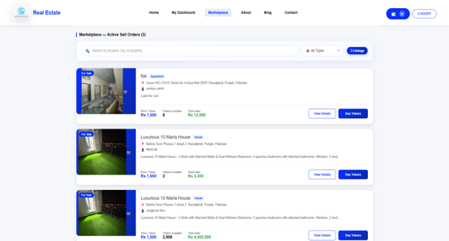
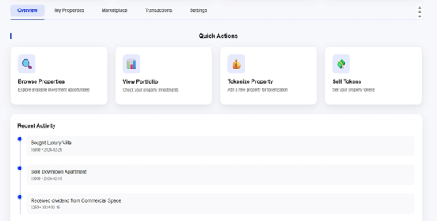

Tokenization of Real-World Assets (RWA) for Rental Property

A blockchain-based platform that enables fractional ownership of rental properties through digital tokens. The system combines Ethereum smart contracts for secure, automated transactions with a traditional Node.js/MySQL backend — giving it the transparency and trustlessness of blockchain with the usability of a normal web app.

🏠 Overview

Buying property outright is expensive and illiquid. This project implements a tokenization model where a rental property is represented as ERC-20-based tokens, allowing multiple investors to own a fraction of it, trade their share on a built-in marketplace, and automatically receive their proportional share of rental income — enforced by smart contracts rather than manual bookkeeping.

The system supports four roles: Admin, Property Owner, Investor, and Tenant, each with role-based dashboards and permissions.

✨ Key Features

Fractional Ownership — properties are tokenized as ERC-20 tokens via a core Solidity contract, enabling multiple investors to own a share of a single property
Role-Based Access Control — Admin, Property Owner, Investor, and Tenant roles, each with dedicated dashboards and permitted actions, enforced both on-chain (via access control roles) and in the backend
KYC Verification — document upload and admin review workflow before users can invest or trade
Property Approval & Tokenization — admins review and approve property listings before they're tokenized and minted
Marketplace — primary token sales plus a secondary market for peer-to-peer listings, bids, and trade execution
Automated Rental Distribution — monthly rental income is calculated per token holder's share and distributed on-chain via a smart contract call
Secondary Market Retention Rule — a property's original owner can never list more than 70% of their token allocation for resale, preventing full liquidation of their founding stake
Wallet Integration — MetaMask connection via Ethers.js, with wallet address persisted to the user's profile
Automated Rent Reminders — a scheduled job (node-cron) triggers tenant rent reminders daily
Transparent, On-Chain Ownership Ledger — token balances and ownership are verifiable on-chain, cross-referenced with off-chain records via transaction hashes

🛠️ Tech Stack

LayerTechnologyFrontendReact 18, Ethers.js v6, CSSBackendNode.js, Express 5, MySQL2, bcrypt (password hashing), multer (file uploads), node-cron (scheduled jobs)DatabaseMySQL (via XAMPP)BlockchainSolidity v0.8.20, OpenZeppelin (ERC-20 + AccessControl), Hardhat, deployed on Sepolia testnetWalletMetaMask

Architecture

A three-tier client-server architecture with an added blockchain layer:

Presentation Layer — React frontend, split into a UserPanel (Home, Marketplace, role-aware Dashboard, Login/Register) and an AdminPanel (KYC review, tokenization requests, listings, compliance)
Application Layer — Express backend handling auth, KYC processing, property/marketplace routes, and acting as the bridge between frontend, database, and blockchain
Data Layer — MySQL for off-chain data (users, KYC details, properties, token transactions, rental distributions)
Blockchain Layer — RealEstateRWA.sol (extends OpenZeppelin ERC-20 + AccessControl) plus four role-specific controller contracts (AdminController, InvestorController, PropertyOwnerController, TenantController) that route role-specific actions to the core contract

Smart Contract Layer

The core contract, RealEstateRWA.sol, handles property records, KYC status, token balances, rent accumulators, and frozen-property flags, exposing functions including submitKYCFor, approveKYC, createAndApproveProperty, mintTokens, assignTenant, executeTrade, payRent, withdrawRent, freezeProperty, and unfreezeProperty. Four thin controller contracts sit in front of it so each role (Admin, Investor, Property Owner, Tenant) only interacts through the functions relevant to them.

Backend API

Route modules include /routes/auth (register, login, password reset — sessions via bcrypt-hashed passwords, not JWT), /routes/kyc, /routes/user (profile, wallet address persistence), /routes/property (listings, approvals, sell-orders, holdings, rent payment/withdrawal), /routes/marketplace, and /routes/notificationRoutes (rent-reminder triggers). File uploads (KYC documents, property/profile images) are handled via multer and served as static files.

Frontend

Two custom hooks centralize all blockchain access: useWeb3 (wallet connection, account/chain/balance state) and useContracts (instantiating Ethers.js contract objects from ABIs in src/abis and addresses in src/contracts). Dashboard.js composes the bulk of investor/owner functionality across sub-components (UnifiedPortfolioTab, RealTransactionsTab, PropertiesTab, RentalIncomeTab).

📸 Screenshots

### Admin Dashboard
   
   
### KYC Approve/Reject
   

### Marketplace
   

### Overview
   

### Property Listing
   

### User Dashboard
   

🚀 Getting Started

Prerequisites

Node.js v18+ and npm v9+
MySQL (e.g. via XAMPP)
MetaMask browser extension (configured for the Sepolia testnet)

Installation

bash# Clone the repository
git clone https://github.com/MuhammadHaris20/tokenization-rental-property.git
cd tokenization-rental-property

# Install backend dependencies
cd backend
npm install

# Install frontend dependencies
cd ../frontend
npm install

Database Setup

Run the provided SQL migration script against MySQL to create the required tables (users, properties, kyc_requests, and others).

Environment Variables

Copy .env.example to .env in the backend directory and populate it with your database credentials and Sepolia network details.

bashcp .env.example .env

Deploy Smart Contracts (Sepolia testnet)

bashnpx hardhat run scripts/deploy.js --network sepolia

Deployed contract addresses are printed to the console and stored in src/contracts.

Run the Application

bash# In /backend
npm start

# In /frontend (separate terminal)
npm start

Open the app in your browser, connect MetaMask (Sepolia testnet), and log in.

📂 Project Structure

tokenization-rental-property/
├── backend/            # Express API (auth, KYC, property, marketplace routes)
├── frontend/            # React app (UserPanel, AdminPanel, dashboards)
│   ├── src/abis/         # Contract ABIs
│   └── src/contracts/    # Deployed contract addresses
├── contracts/            # Solidity smart contracts (RealEstateRWA.sol + controllers)
├── scripts/               # Hardhat deployment scripts
└── README.md

🔮 Future Improvements

Move file storage (KYC docs, property images) to IPFS instead of server file system
Automated secondary-market price discovery
Multi-property portfolio analytics dashboard

👤 Author

Muhammad Haris
Software Engineering Graduate
📧 haristalha786@gmail.com
🔗 GitHub

📄 License

This project was developed as a Final Year Project for academic purposes.
